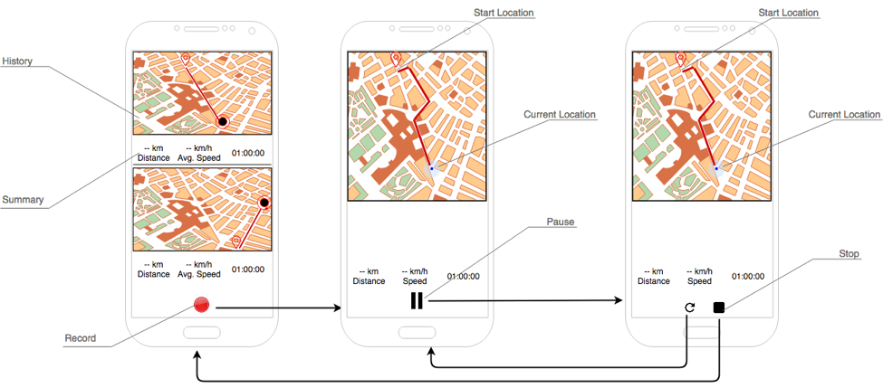

This is TrackMe feature written by java
Feature:
  - Show history of user, the speed, distance, duration
  - Route should be displayed on the Map
  - User can Start, Pause, Resume, Stop track service
  - Tracking Service can run on background to save battery
Technical:
  - Recycler with many mapview to show history of tracking
  - Display route in the mapview and calculate speed via distance gps location and duration
  - Tracking service run in background
  - Communicate with service via Receiver and Broadcast message
  - when user reboot device, application will check and start tracking service if it not stop by user
  - Save database with room architecture
  - Load data with rxjava
 
 Mockup: 
  
